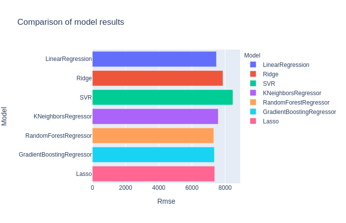
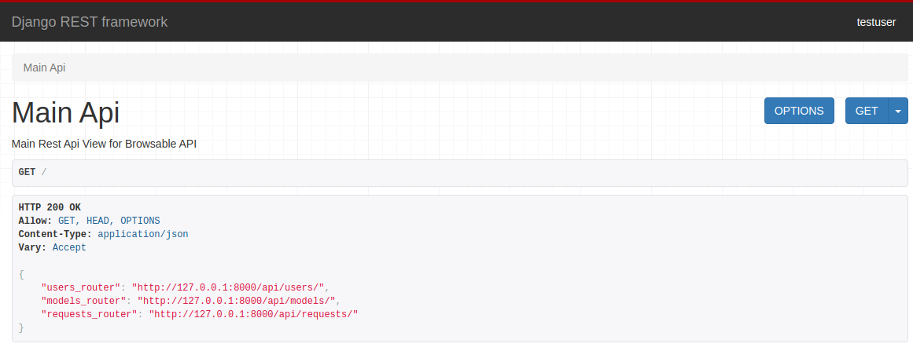
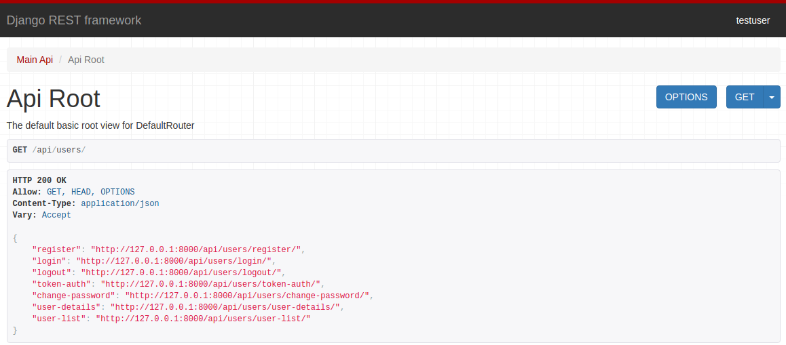
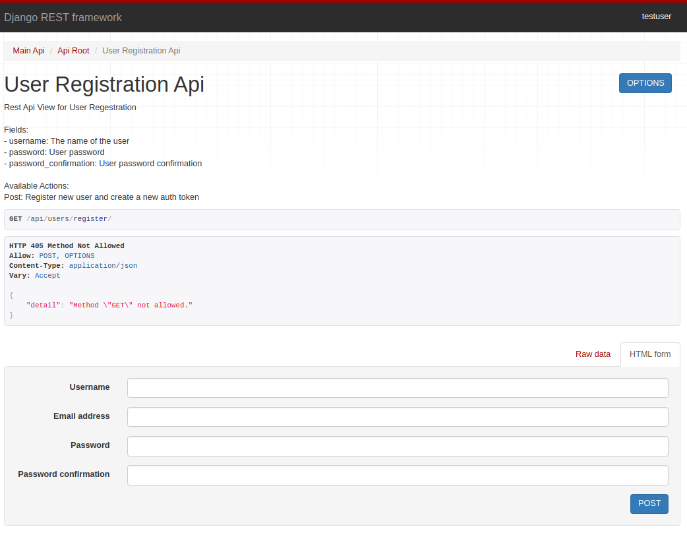
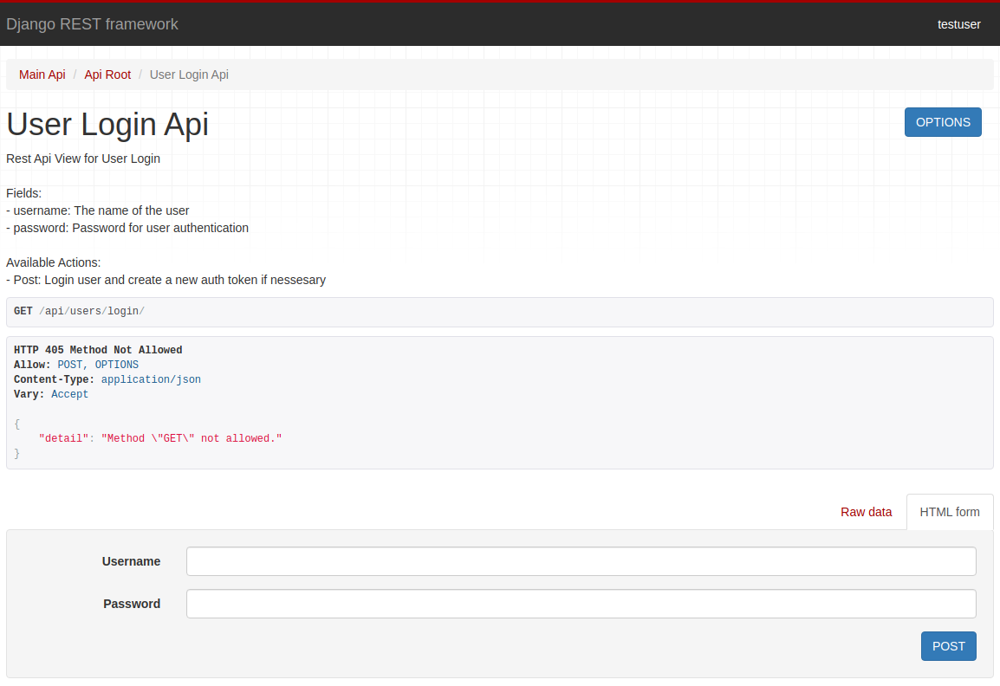
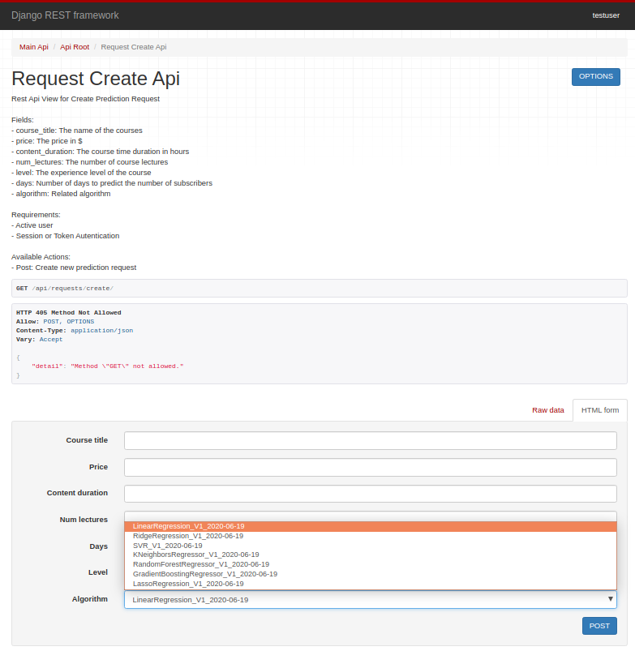
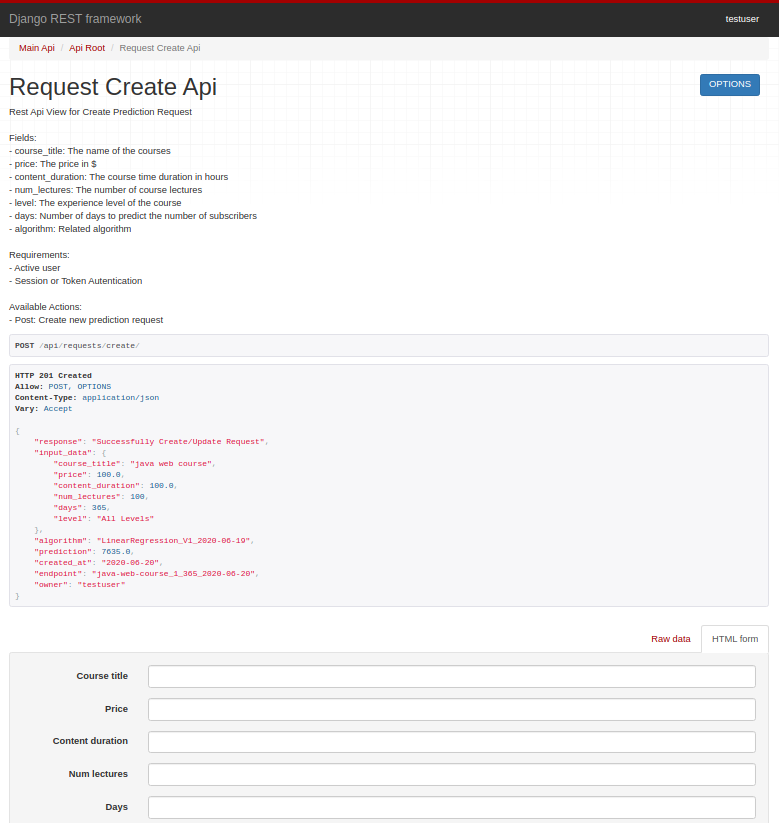

# Udemy_Courses_Rest_Api

## Overview
The goal of this project is to build ML system available with REST API. For building the ML service I used <i>Django</i> and <i>Django Rest Framework</i>.This machine learning web service system is designed to predict the number of subscribers of a online course after a specified time based on parameters such as:
- keywords in course title
- course price 
- course level
- number of lectures
- content duration

I trained several ML models (with tuning hyperparameters) and placed them on a web server:
- LinearRegression
- RidgeRegression
- LassoRegression
- SVR with RBF kernel
- KNeighborsRegressor
- RandomForestRegressor
- GradientBoostingRegressor

## Data
Data come from [https://www.kaggle.com/andrewmvd/udemy-courses/](https://www.kaggle.com/andrewmvd/udemy-courses/). Dataset cointains 3600+ Udemy Course come from 4 categories:
- Business Finance
- Graphic Design 
- Musical Instruments
- Web Development

## Requirements
* python 3.7
* django 2.2.7
* djangorestframework 3.11.0
* pandas
* numpy
* nltk
* scikit-learn
* plotly

## Content
* <i>requirements.txt</i> - file with all required packages.
* <i>Analitics</i> - folder contains all files related to analitics part of application like datasets, ml models, notebook with a description of prepare ml models and EDTA.
* <i>ML_App</i> - folder contains web app files.
* <i>Images</i> - folder contains screenshots and chars to create Readme.

## How to run application 
- <i>Download repository</i>. git clone https://github.com/Cyki89/Rest_Api.git.
- <i>Create new virtual enviroment</i>. mkvirtualenv --python=/usr/bin/python3.7 virtualenv_name.
- <i>Install dependecies</i>. pip install -r requirements.txt.
- <i>Go to main application folder</i>. cd ML_App.
- <i>Run server on your local machine</i>. python manage.py runserver.
- <i>Open localhost in your browser</i>. https://127.0.0.1:8000. You should look Main Browable api view like this:

- <i>Go to 'users_router'</i>. http://127.0.0.1:8000/api/users/.

- <i>Register new user</i>. http://127.0.0.1:8000/api/users/register/ or use <i>TestUser</i> account with password: <i>test1234</i>.

- <i>Go to login view</i>. http://127.0.0.1:8000/api/users/login/. You can copy token to use token authentication in future steps.

- <i>Go to 'requests_router</i>. http://127.0.0.1:8000/api/requests/

- <i>Create request</i>. http://127.0.0.1:8000/api/requests/create/. You have to be logged in or pass valid token in headers to make a request. Fill request form and click POST button:

- <i>See prediction</i>. You should receive response in JSON Format:

- Then you can change the request parameters, make another request, see a list of all requests or filter the results you are interested in.

# Future improvement
- Deploy this application on a public web server (currently all free servers offer insufficient capacity to store all necessary dependencies).
- Add User Interface.
